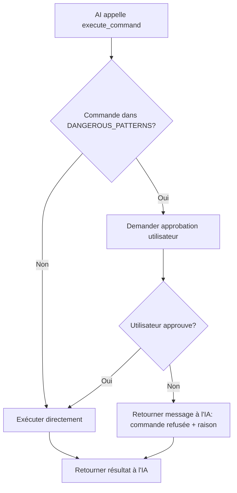

# Plan: Inverser la logique de sécurité des commandes

## Résumé

Actuellement, Nyx utilise une **whitelist** de commandes autorisées (lecture seule).  
L'objectif est d'inverser cette logique pour que **toutes les commandes soient autorisées par défaut**, sauf celles identifiées comme destructrices. Pour ces commandes dangereuses, un **mécanisme d'approbation interactive** sera mis en place.

---

## Changements détaillés

### 1. Modifier la description de l'outil `execute_command` dans [`nyx/agent.py`](nyx/agent.py:32-187)

**Actuel :**
```python
ToolDefinition(
    name="execute_command",
    description="Execute a shell command on the local system. Only safe, read-only commands are allowed (ls, cat, grep, find, git status, etc.).",
    ...
)
```

**Nouveau :**
```python
ToolDefinition(
    name="execute_command",
    description="Execute a shell command on the local system. Most commands are allowed. Destructive commands (rm, sudo, chmod, etc.) require user approval before execution.",
    ...
)
```

---

### 2. Supprimer la whitelist `SAFE_COMMANDS` et la méthode `_is_safe_command` dans [`nyx/agent.py`](nyx/agent.py:235-260)

- Supprimer la constante de classe `SAFE_COMMANDS` (lignes 235-241)
- Supprimer la méthode statique `_is_safe_command` (lignes 253-260)
- La nouvelle logique est : **tout ce qui n'est pas dangereux est autorisé**

---

### 3. Conserver et enrichir `DANGEROUS_PATTERNS` dans [`nyx/agent.py`](nyx/agent.py:244-251)

La blacklist des motifs dangereux est conservée et peut être enrichie :

```python
DANGEROUS_PATTERNS: list[str] = [
    "rm ", "rmdir ", "mv ", "cp ", "chmod ", "chown ", "dd ",
    ">", ">>", "|", "sudo ", "su ", "passwd", "kill ",
    "mkfs", "fdisk", "mount", "umount", "iptables",
    "wget ", "curl ", "apt ", "yum ", "dnf ", "pacman",
    "pip install", "npm install", "git push", "git reset",
    "git rebase", "git merge", "git cherry-pick",
    "docker ", "systemctl", "journalctl",
]
```

---

### 4. Nouvelle logique dans `_execute_tool` pour `execute_command` dans [`nyx/agent.py`](nyx/agent.py:460-499)

Remplacer la logique actuelle (whitelist → block) par :

```
SI commande correspond à un motif DANGEREUX:
    → Demander approbation utilisateur (via callback)
    → Si l'utilisateur approuve → exécuter
    → Si l'utilisateur refuse → retourner message explicatif à l'IA
SINON:
    → Exécuter directement (tout est permis par défaut)
```

**Nouveau flux :**

```python
if name == "execute_command":
    command = args.get("command", "")
    timeout = args.get("timeout", 30)

    if self._is_dangerous_command(command):
        # Demander approbation à l'utilisateur
        approved, reason = self._request_command_approval(command)
        if not approved:
            logger.warning("User denied dangerous command: %s", command)
            return (
                f"[SECURITY] Command denied by user: '{command[:200]}'\n"
                f"Reason: {reason}\n"
                f"Please try a different approach that doesn't require this command."
            )
        logger.info("User approved dangerous command: %s", command)

    # Exécution (que la commande soit dangereuse approuvée ou non)
    import subprocess
    ...
```

---

### 5. Nouveau mécanisme d'approbation interactive

Deux options sont possibles :

#### Option A : Callback d'approbation (recommandée)

Ajouter un attribut `on_command_approval` à la classe `Agent` :

```python
# Dans Agent.__init__
self.on_command_approval: Callable[[str], tuple[bool, str]] | None = None
```

Méthode `_request_command_approval` :

```python
def _request_command_approval(self, command: str) -> tuple[bool, str]:
    """Request user approval for a dangerous command.
    Returns (approved: bool, reason: str).
    """
    if self.on_command_approval:
        return self.on_command_approval(command)
    # Par défaut, si pas de callback, on refuse
    return False, "No approval mechanism configured."
```

#### Option B : Prompt direct dans le terminal

Si on veut une version plus simple sans callback, on peut faire un `input()` direct :

```python
def _request_command_approval(self, command: str) -> tuple[bool, str]:
    print(f"\n⚠️  [SECURITY] The AI wants to execute a potentially dangerous command:")
    print(f"   Command: {command}")
    response = input("   Allow this command? (y/n): ").strip().lower()
    if response == "y":
        return True, ""
    else:
        reason = input("   Reason for denial (optional, for AI feedback): ").strip()
        return False, reason or "User denied the command."
```

**Recommandation :** Utiliser l'**Option A** (callback) car elle est plus propre et permet :
- L'intégration avec Rich TUI pour une meilleure UI
- La possibilité de logger la décision
- La réutilisabilité

---

### 6. Implémenter le callback dans [`nyx/cli.py`](nyx/cli.py:127-213) et [`nyx/cli_rich.py`](nyx/cli_rich.py:144-247)

#### Dans `nyx/cli.py` — `run_ansi_interactive` :

```python
def _make_approval_handler() -> Callable[[str], tuple[bool, str]]:
    def handle_approval(command: str) -> tuple[bool, str]:
        print(f"\n{c('⚠️  SECURITY', YELLOW)} The AI wants to execute a potentially dangerous command:")
        print(f"  {c(command, CYAN)}")
        response = input(f"  {c('Allow?', BOLD)} (y/n): ").strip().lower()
        if response == "y":
            return True, ""
        else:
            reason = input(f"  {c('Reason for denial:', DIM)} ").strip()
            return False, reason or "User denied the command."
    return handle_approval
```

Puis passer le handler à l'agent :
```python
agent.on_command_approval = _make_approval_handler()
```

#### Dans `nyx/cli_rich.py` — `run_rich_interactive` :

Même principe mais avec Rich :
```python
def _make_rich_approval_handler(console) -> Callable[[str], tuple[bool, str]]:
    def handle_approval(command: str) -> tuple[bool, str]:
        console.print("\n[bold yellow]⚠️  SECURITY[/bold yellow] The AI wants to execute a potentially dangerous command:")
        console.print(f"  [cyan]{command}[/cyan]")
        response = console.input(f"  [bold]Allow?[/bold] (y/n): ").strip().lower()
        if response == "y":
            return True, ""
        else:
            reason = console.input(f"  [dim]Reason for denial:[/dim] ").strip()
            return False, reason or "User denied the command."
    return handle_approval
```

---

### 7. Mettre à jour les tests dans [`tests/test_agent.py`](tests/test_agent.py:51-106)

Les tests à modifier :

| Test | Changement |
|------|-----------|
| `test_safe_commands_allowed` | À SUPPRIMER (plus de whitelist) |
| `test_dangerous_commands_detected` | À CONSERVER (toujours valide) |
| `test_safe_commands_not_dangerous` | À CONSERVER (toujours valide) |
| `test_unknown_command_not_safe` | À MODIFIER : une commande inconnue doit maintenant être AUTORISÉE |
| `test_execute_safe_command` | À CONSERVER (toujours valide) |
| `test_execute_dangerous_command_blocked` | À MODIFIER : doit tester que l'approbation est demandée |
| `test_execute_unknown_command_blocked` | À MODIFIER : une commande inconnue doit maintenant PASSER |

Nouveaux tests à ajouter :

```python
def test_unknown_command_now_allowed(self):
    """Unknown commands should now be allowed by default."""
    tc = ToolCall(id="1", name="execute_command", arguments={"command": "docker ps"})
    result = self.agent._execute_tool(tc)
    assert "SECURITY" not in result  # Ne doit plus être bloqué

def test_dangerous_command_requires_approval(self):
    """Dangerous commands should trigger the approval flow."""
    # Configurer un mock pour on_command_approval
    self.agent.on_command_approval = lambda cmd: (False, "Testing denial")
    tc = ToolCall(id="2", name="execute_command", arguments={"command": "rm -rf /tmp/test"})
    result = self.agent._execute_tool(tc)
    assert "denied by user" in result.lower()
```

---

## Diagramme de flux



---

## Fichiers à modifier

| Fichier | Modifications |
|---------|--------------|
| [`nyx/agent.py`](nyx/agent.py) | - Supprimer `SAFE_COMMANDS` et `_is_safe_command`<br>- Ajouter `on_command_approval` callback<br>- Ajouter `_request_command_approval`<br>- Modifier la logique `execute_command`<br>- Mettre à jour la description du tool |
| [`nyx/cli.py`](nyx/cli.py) | - Ajouter `_make_approval_handler`<br>- Passer le handler à l'agent dans `run_ansi_interactive` et `run_ansi_single` |
| [`nyx/cli_rich.py`](nyx/cli_rich.py) | - Ajouter `_make_rich_approval_handler`<br>- Passer le handler à l'agent dans `run_rich_interactive` et `run_rich_single` |
| [`tests/test_agent.py`](tests/test_agent.py) | - Adapter les tests à la nouvelle logique |

---

## Ordre d'exécution

1. Modifier [`nyx/agent.py`](nyx/agent.py) — la logique centrale
2. Modifier [`nyx/cli.py`](nyx/cli.py) — le handler ANSI
3. Modifier [`nyx/cli_rich.py`](nyx/cli_rich.py) — le handler Rich
4. Mettre à jour [`tests/test_agent.py`](tests/test_agent.py) — les tests