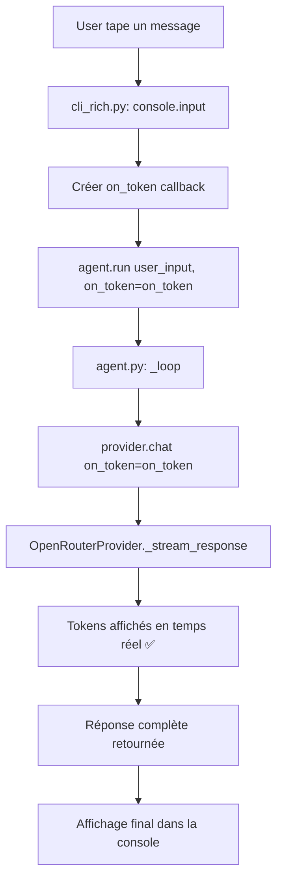
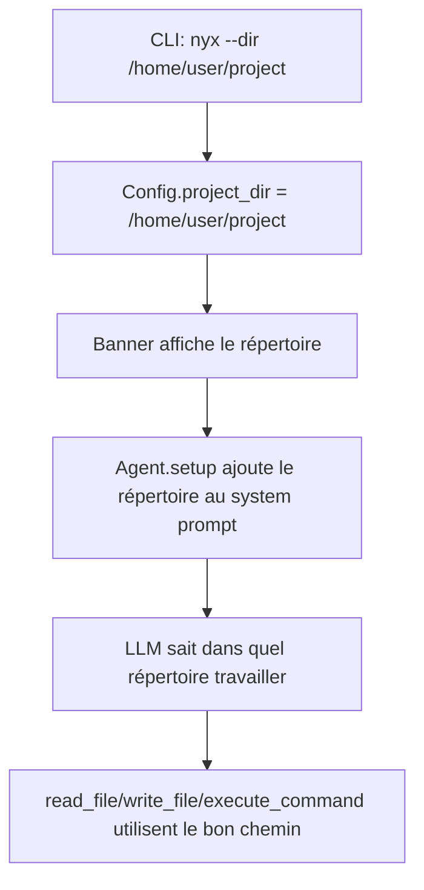

# Plan de correction — Nyx CLI

## Résumé des problèmes identifiés

### Problème 1 : L'agent ne répond pas (streaming cassé)

**Cause racine :** Le callback `on_token` est créé dans la boucle interactive mais **jamais passé à `agent.run()`**.

Dans [`nyx/cli_rich.py:230-236`](../nyx/cli_rich.py:230) et [`nyx/cli.py:184-189`](../nyx/cli.py:184) :
```python
on_token = _make_rich_on_token()   # ← créé
# ...
result = agent.run(user_input)     # ← on_token n'est pas passé !
```

La méthode [`Agent.run()`](../nyx/agent.py:280) n'accepte pas de paramètre `on_token`. Le `on_token` est stocké dans `self.on_token` lors de l'initialisation de l'Agent, mais n'est jamais mis à jour dans la boucle interactive.

**Conséquence :** En mode streaming (`stream: true`), l'agent appelle le provider avec `stream=True` mais sans `on_token` valide. Le provider [`OpenRouterProvider.chat()`](../nyx/providers/openrouter.py:16) reçoit `on_token=None` et ne peut donc pas afficher les tokens en temps réel. L'utilisateur ne voit rien tant que la réponse complète n'est pas reçue... mais le problème est plus profond : le `on_token` passé à `_stream_response` est `None`, donc les tokens sont collectés mais jamais affichés. La réponse finit par arriver mais l'utilisateur ne voit rien pendant l'attente.

**En réalité**, le vrai problème est que `on_token` n'est pas transmis à `agent.run()`. Regardons le flux complet :

1. [`cli_rich.py:230`](../nyx/cli_rich.py:230) : `on_token = _make_rich_on_token()` → callback créé
2. [`cli_rich.py:236`](../nyx/cli_rich.py:236) : `result = agent.run(user_input)` → `on_token` non passé
3. [`agent.py:280`](../nyx/agent.py:280) : `def run(self, user_input: str) -> str:` → pas de paramètre on_token
4. [`agent.py:295-300`](../nyx/agent.py:295) : `response = self.provider.chat(messages=..., stream=self.config.stream, on_token=self.on_token)` → utilise `self.on_token` qui est `None` (jamais défini dans la boucle interactive)

**Solution :** Ajouter un paramètre `on_token` à `Agent.run()` et le passer au provider.

### Problème 2 : Pas de répertoire de travail configurable

**Cause :** Aucun mécanisme pour spécifier dans quel répertoire l'IA doit travailler. Les outils `read_file`, `write_file`, `execute_command` utilisent des chemins absolus ou relatifs au répertoire courant, sans concept de "projet".

**Solution :** Ajouter un flag `--dir` / `--project` pour définir le répertoire de travail, et le transmettre dans le system prompt.

---

## Plan d'implémentation

### Étape 1 : Corriger le streaming — Passer `on_token` à `agent.run()`

**Fichiers à modifier :**
- [`nyx/agent.py`](../nyx/agent.py)
- [`nyx/cli_rich.py`](../nyx/cli_rich.py)
- [`nyx/cli.py`](../nyx/cli.py)

**Changements :**

1. Dans [`Agent.run()`](../nyx/agent.py:280), ajouter un paramètre optionnel `on_token` :
   ```python
   def run(self, user_input: str, on_token: Callable[[str], None] | None = None) -> str:
   ```
   Et l'utiliser dans `_loop()` :
   ```python
   response = self.provider.chat(
       messages=self.context.messages,
       tools=self.tools if self.tools else None,
       stream=self.config.stream,
       on_token=on_token or self.on_token,
   )
   ```

2. Dans [`cli_rich.py:236`](../nyx/cli_rich.py:236), passer `on_token` :
   ```python
   result = agent.run(user_input, on_token=on_token)
   ```

3. Dans [`cli.py:189`](../nyx/cli.py:189), passer `on_token` :
   ```python
   result = agent.run(user_input, on_token=on_token)
   ```

### Étape 2 : Ajouter le flag `--dir` / `--project`

**Fichiers à modifier :**
- [`nyx/cli.py`](../nyx/cli.py)
- [`nyx/config.py`](../nyx/config.py)
- [`nyx/agent.py`](../nyx/agent.py)

**Changements :**

1. Dans [`Config`](../nyx/config.py:49), ajouter un champ `project_dir` :
   ```python
   project_dir: str = ""
   ```

2. Dans [`main()`](../nyx/cli.py:216), ajouter les arguments CLI :
   ```python
   parser.add_argument("-d", "--dir", type=str, default="", help="Working directory for the AI")
   parser.add_argument("--project", type=str, default="", help="Project directory (alias for --dir)")
   ```

3. Dans [`main()`](../nyx/cli.py:216), après le chargement de la config, appliquer le répertoire :
   ```python
   if args.dir or args.project:
       config.project_dir = args.dir or args.project
   ```

4. Dans [`Agent.setup()`](../nyx/agent.py:258), ajouter le répertoire de travail au system prompt :
   ```python
   if self.config.project_dir:
       self.context.add("system", f"The current working directory is: {self.config.project_dir}")
   ```

### Étape 3 : Afficher le répertoire de travail dans le banner de bienvenue

**Fichiers à modifier :**
- [`nyx/cli_rich.py`](../nyx/cli_rich.py)
- [`nyx/cli.py`](../nyx/cli.py)

**Changements :**

1. Dans [`welcome_panel()`](../nyx/cli_rich.py:50), ajouter une ligne pour le répertoire de travail.
2. Dans [`print_welcome()`](../nyx/cli.py:104), ajouter une ligne pour le répertoire de travail.

### Étape 4 : Mettre à jour la configuration par défaut

**Fichiers à modifier :**
- [`config.example.json`](../config.example.json)

Ajouter un champ `project_dir` dans l'exemple de configuration.

---

## Diagramme de flux (correction streaming)



## Diagramme de flux (répertoire de travail)



---

## Résumé des fichiers à modifier

| Fichier | Modification |
|---------|-------------|
| [`nyx/agent.py`](../nyx/agent.py) | Ajouter paramètre `on_token` à `run()`, l'utiliser dans `_loop()`, ajouter `project_dir` au system prompt |
| [`nyx/cli_rich.py`](../nyx/cli_rich.py) | Passer `on_token` à `agent.run()`, ajouter `project_dir` au welcome panel |
| [`nyx/cli.py`](../nyx/cli.py) | Passer `on_token` à `agent.run()`, ajouter flags `--dir`/`--project`, ajouter `project_dir` au welcome |
| [`nyx/config.py`](../nyx/config.py) | Ajouter champ `project_dir` |
| [`config.example.json`](../config.example.json) | Ajouter `project_dir` dans l'exemple |