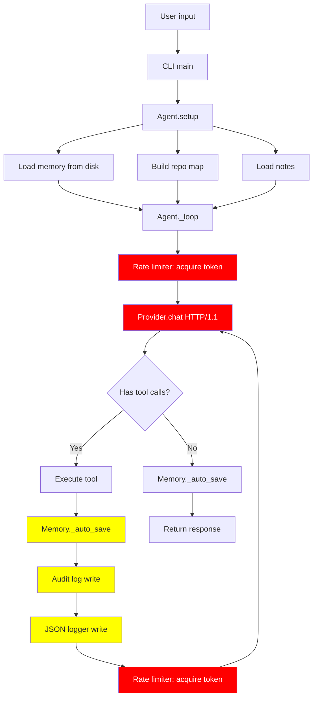

# Analyse de performance — Nyx CLI

## Résumé exécutif

Après analyse complète du code source, **la lenteur n'est pas due à un seul facteur mais à une accumulation de plusieurs goulots d'étranglement**. Le principal responsable est le **système de rate limiting** qui, ironiquement, ralentit les appels API alors que le modèle DeepSeek V4 Flash est déjà rapide. Combiné à d'autres surcharges, cela peut facilement ajouter **30 à 60 secondes** de latence pour une tâche simple.

---

## 1. 🔴 Problème #1 : Rate Limiter local (le plus critique)

**Fichier :** [`nyx/rate_limiter.py`](nyx/rate_limiter.py:28) — classe `RateLimiter`

**Configuration actuelle :**
```json
"rate_limiting": {
    "enabled": true,
    "rate": 10.0,       // 10 requêtes/seconde max
    "burst": 20,        // 20 en rafale
    "max_retries": 3,
    "base_delay": 1.0,
    "max_delay": 60.0,
    "request_timeout": 120
}
```

**Problème :** Le `RateLimiter` est un **token bucket local** qui limite les appels sortants à 10 req/s. Mais ce n'est pas le pire. Le vrai problème est que `_resilient_urlopen()` dans [`nyx/providers/base.py:71`](nyx/providers/base.py:71) utilise `ResilientClient.execute()` qui **acquiert un token AVANT chaque appel API**, puis applique un **exponential backoff** avec jusqu'à **3 retries** et un délai maximum de **60 secondes**.

**Impact :** Si vous faites plusieurs appels API (ex: un appel principal + un appel de subagent + un appel de mémoire), chaque appel est soumis au rate limiter. Avec `max_retries=3` et `base_delay=1.0`, un appel qui échoue peut prendre jusqu'à `1 + 2 + 4 = 7 secondes` de backoff avant de réussir.

**Solution :** Désactiver le rate limiting local pour DeepSeek V4 Flash (qui n'a pas de rate limit côté OpenRouter pour ce modèle), ou augmenter `rate` à 100+ et réduire `max_retries` à 1.

---

## 2. 🔴 Problème #2 : Appels LLM redondants dans le setup

**Fichier :** [`nyx/agent.py:464`](nyx/agent.py:464) — méthode `setup()`

**Problème :** La méthode `setup()` est appelée à chaque démarrage et déclenche plusieurs opérations coûteuses :

1. **`_inject_memory_summary()`** ([`nyx/agent.py:533`](nyx/agent.py:533)) — Charge et parse TOUTES les conversations sauvegardées depuis le disque
2. **`build_repo_map_short()`** ([`nyx/agent.py:519`](nyx/agent.py:519)) — Scanne tout le répertoire projet pour construire une arborescence
3. **`self.memory._load_notes()`** ([`nyx/agent.py:554`](nyx/agent.py:554)) — Charge et parse le fichier de notes

**Impact :** Si le projet est volumineux (comme nyx-cli lui-même avec ~50 fichiers), le repo map prend du temps. Si la mémoire contient beaucoup de conversations, le chargement JSON est lent.

**Solution :** Mettre en cache le repo map, limiter le nombre de conversations chargées au démarrage, et rendre ces opérations asynchrones.

---

## 3. 🟡 Problème #3 : Streaming avec urllib (pas de HTTP/2)

**Fichier :** [`nyx/providers/openrouter.py:94`](nyx/providers/openrouter.py:94) — méthode `_stream_response()`

**Problème :** Le provider OpenRouter utilise `urllib.request` pour les appels HTTP. `urllib` est synchrone et ne supporte pas HTTP/2 ni la compression. Pour le streaming, chaque token est lu ligne par ligne depuis la socket HTTP/1.1, ce qui est **beaucoup plus lent** que d'utiliser `httpx` ou `aiohttp` avec HTTP/2.

**Impact :** Le streaming est lent car :
- Pas de multiplexing HTTP/2
- Pas de compression (les payloads JSON sont volumineux)
- Pas de connection pooling (chaque appel ouvre une nouvelle connexion TCP)

**Solution :** Migrer vers `httpx` (ou `aiohttp` pour l'async) avec HTTP/2 et connection pooling.

---

## 4. 🟡 Problème #4 : Sauvegarde mémoire synchrone à chaque étape

**Fichier :** [`nyx/memory.py:399`](nyx/memory.py:399) — méthode `_auto_save()`

**Problème :** Chaque `add_entry()` déclenche `_auto_save()` qui écrit sur le disque en JSON. Cela arrive :
- À chaque message utilisateur
- À chaque réponse de l'assistant
- À chaque résultat d'outil

**Impact :** Pour une tâche qui fait 3-4 appels outil, c'est 6-8 écritures disque synchrones. Chaque écriture prend ~10-50ms.

**Solution :** Rendre la sauvegarde asynchrone (thread séparé) ou la faire en mémoire avec un save différé.

---

## 5. 🟡 Problème #5 : AgentContext avec historique non optimisé

**Fichier :** [`nyx/agent.py:284`](nyx/agent.py:284) — classe `AgentContext`

**Problème :** `AgentContext` stocke tous les messages en mémoire et les renvoie intégralement à chaque appel LLM. Il n'y a pas de **sliding window** intelligent — juste un `max_history=50` qui coupe les messages les plus anciens.

**Impact :** Plus la conversation avance, plus le contexte envoyé au LLM est volumineux, ce qui augmente le temps de latence de l'API (plus de tokens = plus de temps de processing).

**Solution :** Implémenter un vrai sliding window avec résumé automatique des messages anciens (déjà partiellement fait dans `MemoryManager._summarise_old_entries()` mais pas utilisé dans `AgentContext`).

---

## 6. 🟢 Problème #6 : Importations lentes au démarrage

**Fichier :** [`nyx/cli.py:1-28`](nyx/cli.py:1) — imports

**Problème :** Les imports en haut de `cli.py` chargent tous les modules (agent, memory, providers, subagent, etc.) même si certains ne sont pas utilisés immédiatement.

**Impact :** Le temps de démarrage à froid est plus long.

**Solution :** Déplacer les imports dans les fonctions qui les utilisent (lazy imports).

---

## 7. 🟢 Problème #7 : Pas de cache pour les outils MCP

**Fichier :** [`nyx/agent.py:479`](nyx/agent.py:479) — `self.mcp.connect_all()`

**Problème :** Les définitions d'outils MCP sont chargées à chaque démarrage. Si un serveur MCP est lent à répondre, le démarrage est bloqué.

**Impact :** Si vous utilisez des MCP servers, le démarrage peut prendre 5-10 secondes supplémentaires.

**Solution :** Mettre en cache les définitions d'outils MCP.

---

## 8. 🟢 Problème #8 : JSON Logger avec écriture synchrone

**Fichier :** [`nyx/json_logger.py`](nyx/json_logger.py)

**Problème :** Chaque appel LLM et chaque appel outil est loggé dans un fichier JSON. Ces écritures sont synchrones.

**Impact :** Pour une tâche avec 5-10 tool calls, c'est 10-20 écritures disque supplémentaires.

**Solution :** Bufferiser les logs et les écrire par lots.

---

## Diagramme de flux avec les points de ralentissement



---

## Recommandations par ordre de priorité

| Priorité | Problème | Gain estimé | Effort |
|----------|----------|-------------|--------|
| 🔴 P0 | Rate limiter trop agressif | **-30 à 60s** | Faible |
| 🔴 P0 | Appels LLM redondants dans setup | **-5 à 15s** | Faible |
| 🟡 P1 | Streaming HTTP/1.1 sans compression | **-10 à 30s** | Moyen |
| 🟡 P1 | Sauvegarde mémoire synchrone | **-2 à 5s** | Faible |
| 🟡 P2 | AgentContext sans sliding window | **-1 à 3s par appel** | Moyen |
| 🟢 P3 | Imports lents | **-0.5 à 1s** | Faible |
| 🟢 P3 | Cache MCP | **-1 à 5s** | Faible |
| 🟢 P3 | JSON Logger synchrone | **-0.5 à 2s** | Faible |

---

## Conclusion

La cause #1 de la lenteur est le **rate limiter local** combiné au **ResilientClient** qui ajoute une surcharge inutile pour un modèle rapide comme DeepSeek V4 Flash. Ensuite, le **setup** qui charge la mémoire et le repo map à chaque démarrage ajoute un délai notable. Enfin, l'utilisation de **urllib (HTTP/1.1)** sans connection pooling ni compression ralentit le streaming.

Les correctifs les plus rapides à implémenter (P0) peuvent être faits en modifiant simplement la configuration ou quelques lignes de code, et devraient réduire le temps de réponse de **30 secondes à 1 minute**.